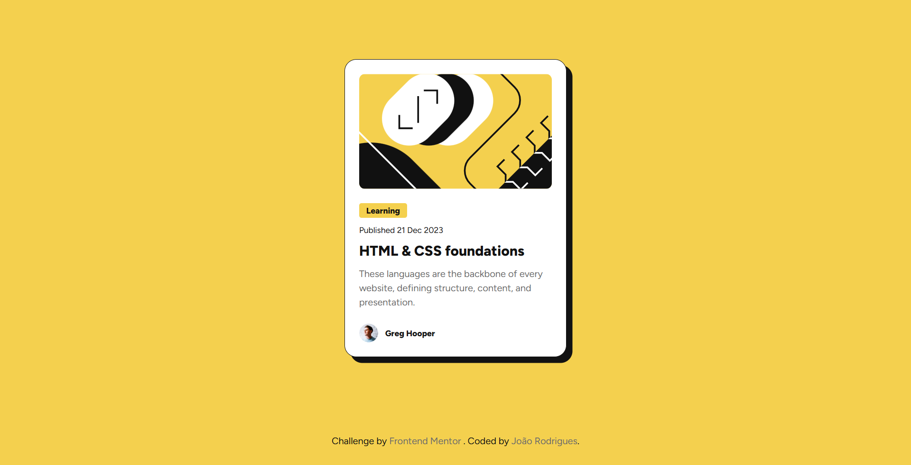

# Frontend Mentor - Blog preview card solution

This is a solution to the [Blog preview card challenge on Frontend Mentor](https://www.frontendmentor.io/challenges/blog-preview-card-ckPaj01IcS). Frontend Mentor challenges help you improve your coding skills by building realistic projects.

## Table of contents

- [Overview](#overview)
  - [The challenge](#the-challenge)
  - [Screenshot](#screenshot)
  - [Links](#links)
- [My process](#my-process)
  - [Built with](#built-with)
- [Author](#author)

**Note: Delete this note and update the table of contents based on what sections you keep.**

## Overview

### The challenge

Users should be able to:

- See hover and focus states for all interactive elements on the page

### Screenshot

### Links

- Solution URL: [solution URL](https://www.frontendmentor.io/solutions/blog-preview-card-using-sass-css-rcvfCReJfw)
- Live Site URL: [site URL](https://joao0330.github.io/blog-preview-card-frontendmentor/)

## My process

### Built with

- Semantic HTML5 markup
- SASS scss
- CSS custom properties
- Flexbox
- Mobile-first workflow

## Author

- Website - [João Rodrigues](https://joaogrodrigues.dev)
- Frontend Mentor - [@Joao0330](https://www.frontendmentor.io/profile/Joao0330)
